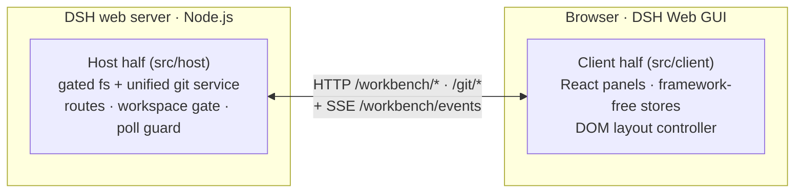

# dsh-workbench — DSH Web GUI right-side workbench

**English** | [中文](https://github.com/doebkblcya/dsh-workbench/blob/main/README.zh-CN.md)

A single-package plugin that adds a VS Code-style workbench to the right side of
the **DSH Web GUI**: a **Preview** column plus a **Files / Git** panel — all
rendered in-page, backed by a real filesystem + git service on the host.

## Screenshots


## Features

- **Files** — a lazy file tree with filename search; clicking a file opens it
  in the Preview column (drag it into the input to insert the path).
- **Git** — two collapsible VS Code-style sections:
  - **Changes**: branch bar (switch / create), commit box, and the changes
    list (staged / unstaged / untracked, each with a count header).
  - **Graph**: the inline Git graph with lanes and ref labels — *windowed*
    rendering keeps large repos light.
- Sections collapse with a smooth 200 ms animation; while both are open a
  draggable divider resizes the split (18%–80%).
- Push/pull report success as a toast; failures show in a dismissible error
  bar with actionable copy (auth / no-upstream / diverged / identity…).
- **Preview** — multi-tab preview of markdown / html / code / diff / csv /
  pdf / office / images / text, with source↔preview toggle, split edit and
  save (write-conflict protected).

## What it does

| Capability | Status |
|---|---|
| File explorer + filename search | ✅ |
| Multi-format preview | ✅ |
| Changes list (stage / unstage / discard) with group counts | ✅ |
| Branch switch / create | ✅ |
| Inline Git graph (windowed) | ✅ |
| Commit | ✅ |
| Push / pull | ✅ (host-side auth; toast + dismissible errors) |
| Collapsible sections with animation + resize divider | ✅ |

## Architecture

The plugin ships two halves in one package; the browser UI and the host
service talk over HTTP + an SSE change stream (fs watch + git poll merged).



- **Host half** (`src/host`): workspace-gated filesystem + a *single unified*
  git service (the two upstream git services merged into one gate, one repo
  cache, one operation-marker probe — 1 git spawn instead of 7).
- **Browser half** (`src/client`): a DOM layout controller that extends the
  shell's grid with the Preview + workbench columns, React components, and
  framework-free stores (layout / explorer / scm / preview / git) with
  per-project persistence.

## Usage

Install the published package:

```sh
dsh plugin --profile web add @doebkblcya/dsh-workbench
```

In any project session the panel appears on the right:

- **Files** tab — browse the tree; click a file to open it in Preview.
- **Git** tab — stage/discard from the changes list, write a message and
  commit (Ctrl+Enter), then push/pull from the branch bar; the graph shows
  the history with refs and lanes.

## Development

```sh
npm install
npm run build        # tsc -b && tsdown → lib/index.js + lib/client.js
npm run typecheck
# link the local checkout into your profile:
dsh plugin --profile web add link:<path-to-this-repo>
```

## License & attribution

BSD-3-Clause. This package is a derivative work of the dsh-web-ui monorepo
(https://github.com/zhu1090093659/dsh-web-ui) — specifically
`dsh-aionui-panel` and `dsh-git-graph` (both 0.1.15). The right-panel design
was itself re-implemented from AionUi (iOfficeAI/AionUi, Apache-2.0). See
[`LICENSE`](./LICENSE) and [`NOTICE`](./NOTICE) for full attribution.

> Note: upstream's `package.json` metadata says `Apache-2.0` while the shipped
> package `LICENSE` files are `BSD-3-Clause` (the repo root LICENSE is
> Apache-2.0). This fork follows the shipped package license (BSD-3-Clause);
> both are permissive and derivative development is compliant either way.
