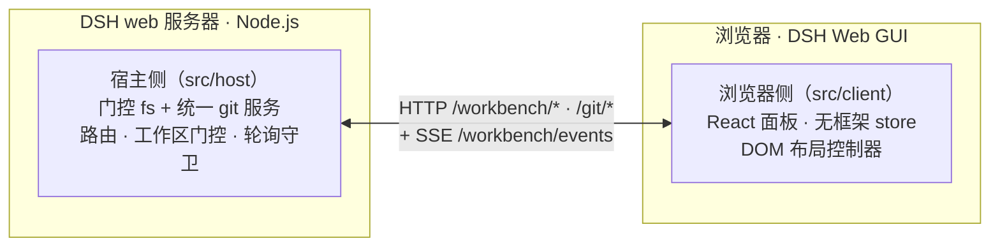

# dsh-workbench — DSH Web GUI 右侧工作台

[English](https://github.com/doebkblcya/dsh-workbench/blob/main/README.md) | **中文**

一个单包插件，为 **DSH Web GUI** 增加 VS Code 风格的右侧工作台：一个
**Preview（预览）** 栏，加一个 **文件 / Git** 面板 —— 界面在页面内渲染，
背后由宿主进程的真实文件系统 + git 服务支撑。

## 截图


| Git 面板 — 可折叠的「更改 / 图表」分节 | 文件树与搜索 |
|---|---|
|  |  |

## 特性

- **文件** —— 懒加载文件树 + 按文件名搜索；点文件在 Preview 栏打开（拖拽可插入路径到输入框）。
- **Git** —— 两个可折叠分节（VS Code 风格）：
  - **更改**：分支栏（切换 / 新建分支）、提交框、变更列表（已暂存 / 未暂存 / 未跟踪，各带数量标题）。
  - **图表**：带泳道和 ref 标签的内嵌 Git 图谱 —— *窗口化*渲染，大仓库也轻量。
- 分节有 200ms 平滑折叠动画；两节都展开时之间有可拖拽分隔线调比例（18%–80%）。
- 推送/拉取成功以 toast 提示；失败显示**可关闭**的错误条（认证 / 无上游 / 分叉 / 身份未配置等均可读文案）。
- **预览** —— markdown / html / code / diff / csv / pdf / office / 图片 / 文本的多 tab 预览，
  支持源码↔预览切换、分屏编辑和保存（带写冲突保护）。

## 功能

| 能力 | 状态 |
|---|---|
| 文件树 + 文件名搜索 | ✅ |
| 多格式预览 | ✅ |
| 变更列表（暂存 / 取消暂存 / 放弃），分组带数量 | ✅ |
| 分支切换 / 新建 | ✅ |
| 内嵌 Git 图谱（窗口化） | ✅ |
| 提交 | ✅ |
| 推送 / 拉取 | ✅（宿主侧认证；成功 toast、失败可关闭） |
| 可折叠分节 + 动画 + 拖拽调比例 | ✅ |

## 架构

插件一个包、两个半身：浏览器 UI 与宿主服务之间走 HTTP + 一条 SSE 变更流
（fs watch 与 git 轮询合流）。



- **宿主侧**（`src/host`）：工作区门控的文件系统 + *统一* 的 git 服务（上游两个 git 服务
  合并成一个门控、一个仓库缓存、一次操作标记探测 —— 1 次 git spawn 而非 7 次）。
- **浏览器侧**（`src/client`）：一个 DOM 布局控制器把 shell 网格扩展出 Preview + 工作台两栏，
  React 组件 + 无框架 store（layout / explorer / scm / preview / git），按项目持久化。

## 使用

安装已发布包：

```sh
dsh plugin --profile web add @doebkblcya/dsh-workbench
```

任意项目会话里右侧即出现工作台：

- **文件** tab —— 浏览文件树；点文件在 Preview 打开。
- **Git** tab —— 在变更列表暂存/放弃，填提交信息后提交（Ctrl+Enter），分支栏推送/拉取；
  图谱展示带 ref 与泳道的提交历史。

## 开发

```sh
npm install
npm run build        # tsc -b && tsdown → lib/index.js + lib/client.js
npm run typecheck
# 本地 checkout 链接安装到 profile：
dsh plugin --profile web add link:<path-to-this-repo>
```

## 许可与署名

BSD-3-Clause。本包是 dsh-web-ui monorepo（https://github.com/zhu1090093659/dsh-web-ui）
的衍生作品——具体是 `dsh-aionui-panel` 和 `dsh-git-graph`（均 0.1.15）。右侧面板设计
本身重新实现了 AionUi（iOfficeAI/AionUi，Apache-2.0）。完整署名见
[`LICENSE`](./LICENSE) 和 [`NOTICE`](./NOTICE)。

> 说明：上游 `package.json` 元数据写的是 `Apache-2.0`，而包里实际发布的 `LICENSE`
> 文件是 `BSD-3-Clause`（仓库根 LICENSE 才是 Apache-2.0）。本 fork 遵循实际发布的包
> 许可证（BSD-3-Clause）；两者皆为宽松许可证，衍生开发无论哪种都合规。
